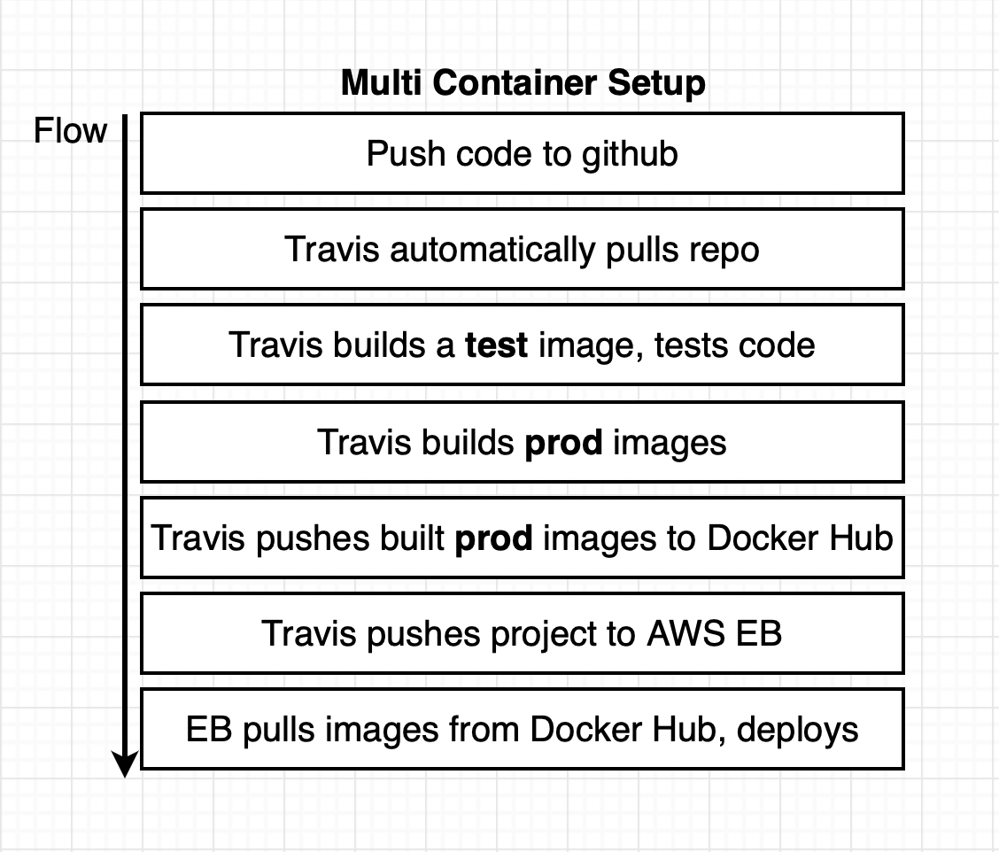
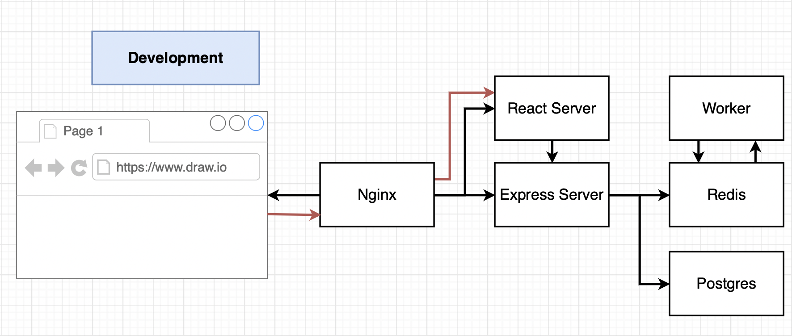
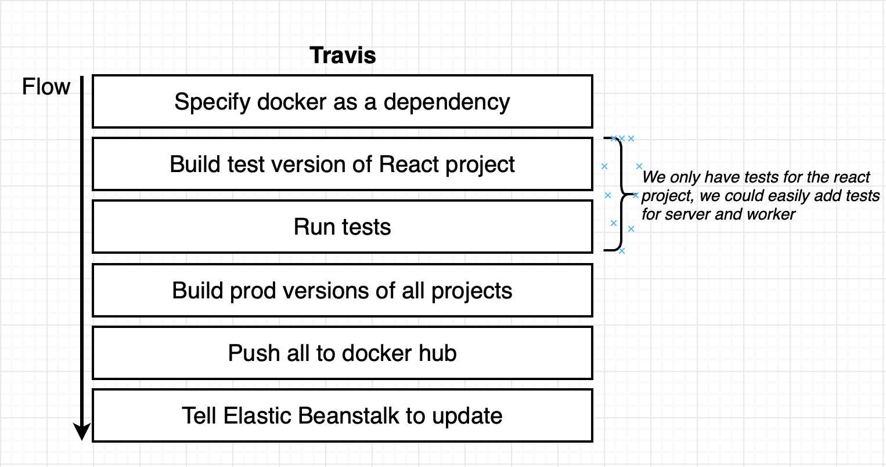

# Multi-Container Deployments to AWS
The workflow for a multi-container deployment can be described as follows:



The setup of the application used for this course can be seen below:



## File setup
### Nginx setup
#### Config file

#### Dockerfile

### React server setup
#### Fib component

#### OtherPage

#### App.js

### Express server setup
#### package.json

#### keys.js

#### index.js

#### Dockerfile

### Worker setup
#### package.json

#### keys.js

#### index.js

#### Dockerfile

## Travis config
The config file will have the following high-level steps:



### The file:
```
sudo: required
services:
  - docker

before_install:
  # Build dev image
  - docker build -t matthewjhcarr/react-test -f ./client/Dockerfile.dev ./client

script:
  # Run tests on dev image
  - docker run CI=true matthewjhcarr/react-test yarn test -- --coverage

after_success:
  # Build prod images
  - docker build -t matthewjhcarr/multi-client ./client
  - docker build -t matthewjhcarr/multi-nginx ./nginx
  - docker build -t matthewjhcarr/multi-server ./server
  - docker build -t matthewjhcarr/multi-worker ./worker
  # Login to docker CLI
  - echo "$DOCKER_PASSWORD" | docker login -u "$DOCKER_ID" --password-stdin
  # Push prod images to docker hub
  - docker push matthewjhcarr/multi-client
  - docker push matthewjhcarr/multi-nginx
  - docker push matthewjhcarr/multi-server
  - docker push matthewjhcarr/multi-worker
```
### The important bits:
`services`: specify that we need docker installed on the machine
`before_install`: this is where we build our dev images  
`script`: this is where we run our images  
`after_install`: this is where we build our prod images

```
echo "$DOCKER_PASSWORD | docker login -u "$DOCKER_ID" --password-stdin
```
`echo "$DOCKER_PASSWORD | ...`:  
Retrieves password from the environment variable and echos it via stdin as input to the next command (the command on the other side of the pipe)

`docker login -u "$DOCKER_ID"`:  
Executes the login command with the username stored in the environment variable

`--password-stdin`:  
A flag that tells `docker login` that it can expect to receive the password via stdin