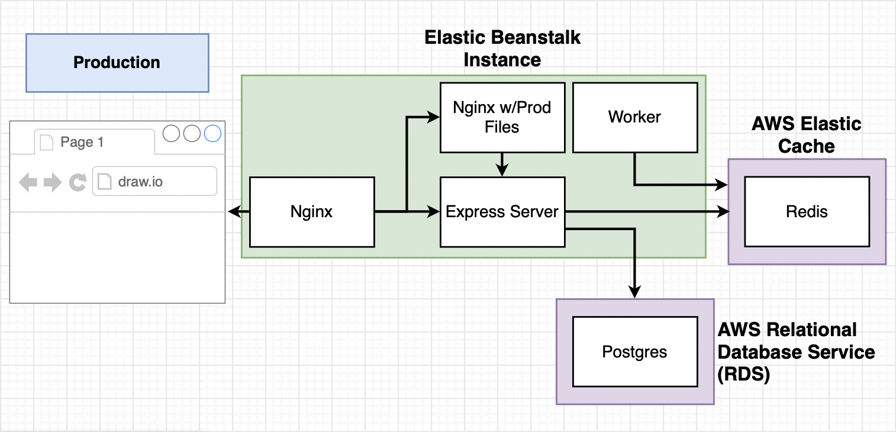

# Multi-Container Deployments to AWS
The workflow for a multi-container deployment can be described as follows:


The setup of the application used for this course can be seen below:


## File setup
### Nginx setup
#### Config file

#### Dockerfile

### React server setup
#### Fib component

#### OtherPage

#### App.js

### Express server setup
#### package.json

#### keys.js

#### index.js

#### Dockerfile

### Worker setup
#### package.json

#### keys.js

#### index.js

#### Dockerfile

## Travis config
The config file will have the following high-level steps:


### The file:
```
sudo: required
services:
  - docker

before_install:
  # Build dev image
  - docker build -t matthewjhcarr/react-test -f ./client/Dockerfile.dev ./client

script:
  # Run tests on dev image
  - docker run CI=true matthewjhcarr/react-test yarn test -- --coverage

after_success:
  # Build prod images
  - docker build -t matthewjhcarr/multi-client ./client
  - docker build -t matthewjhcarr/multi-nginx ./nginx
  - docker build -t matthewjhcarr/multi-server ./server
  - docker build -t matthewjhcarr/multi-worker ./worker
  # Login to docker CLI
  - echo "$DOCKER_PASSWORD" | docker login -u "$DOCKER_ID" --password-stdin
  # Push prod images to docker hub
  - docker push matthewjhcarr/multi-client
  - docker push matthewjhcarr/multi-nginx
  - docker push matthewjhcarr/multi-server
  - docker push matthewjhcarr/multi-worker
```
### The important bits:
`services`: specify that we need docker installed on the machine
`before_install`: this is where we build our dev images  
`script`: this is where we run our images  
`after_install`: this is where we build our prod images

```
echo "$DOCKER_PASSWORD | docker login -u "$DOCKER_ID" --password-stdin
```
`echo "$DOCKER_PASSWORD | ...`:  
Retrieves password from the environment variable and echos it via stdin as input to the next command (the command on the other side of the pipe)

`docker login -u "$DOCKER_ID"`:  
Executes the login command with the username stored in the environment variable

`--password-stdin`:  
A flag that tells `docker login` that it can expect to receive the password via stdin

## AWS EBS config
### Important note about Linux 2
In the course we're following, the video talks about creating a `Dockerrun.aws.yml` file with container definitions, as opposed to a `docker-compose.yml` file with service definitions.

Since Amazon have changed their platform in the meantime, the whole Dockerrun thing isn't strictly relevant anymore. Instead, we must write a new `docker-compose.yml` file and rename our existing `docker-compose.yml` to `docker-compose-dev.yml`. This new `docker-compose.yml` file _will_ be composed of Container Definitions, so it's not a total a wasted effort.

The two differences between the Dockerrun file spoken about in the videos and the new docker-compose way of defining things are as follows:
1. No Container Links
    Docker Compose can handle container communication automatically, so we don't need to manually add anything to a links array _(and we can probably skip the Forming Container Links lecture)_
2. Environment Variables
    We must explicitly specify the environment variables each service needs access to. The environment variables we need are covered in the __173. Setting Environment Variables__ lecture. Pay attention to that and come back to update the `docker-compose.yml` file.
### Container Definitions
Documentation on _'task definitions'_ (and by extension container definitions) can be found on [the AWS website](https://docs.aws.amazon.com/AmazonECS/latest/developerguide/task_definition_parameters.html#container_definitions). This gives a lot of useful information about the kinds of parameters used when writing these definitions.

Our `docker-compose.yml` file is written as follows:
```
version: '3'
services:
  client:
    image: 'matthewjhcarr/multi-client'
    hostname: 'client'
    mem_limit: 128m
  nginx:
    image: 'matthewjhcarr/multi-nginx'
    hostname: 'nginx'
    mem_limit: 128m
    ports:
      - '80:80'
  server:
    image: 'matthewjhcarr/multi-server'
    hostname: 'api'
    mem_limit: 128m
    environment:
      - REDIS_HOST=$REDIS_HOST
      - REDIS_PORT=$REDIS_PORT
      - PGUSER=$PGUSER
      - PGHOST=$PGHOST
      - PGDATABASE=$PGDATABASE
      - PGPASSWORD=$PGPASSWORD
      - PGPORT=$PGPORT
  worker:
    image: 'matthewjhcarr/multi-worker'
    hostname: 'worker'
    mem_limit: 128m
    environment:
      - REDIS_HOST=$REDIS_HOST
      - REDIS_PORT=$REDIS_PORT
```
The important things to note here are the following:

`image`:  
This is the name of the image that you pushed your docker hub.

`hostname`:  
Unlike a regular `docker-compose.yml` file, here we are explicitly defining the name by which other containers may access this container. Previously, this was implicit in the definition, _i.e. if you had a block called 'client', the container would be named 'client'_, however now we must explicitly name the containers by using `hostname`.  
For example, the `server` block has a `hostname` of `api`. This container would __not__ be named `server`, but would __instead__ be named `api`.

`mem_limit`:  
EBS doesn't like it if there are no memory limits for deployed containers, so we use the `mem_limit` option here. In general, you should do some reasearch based on the kind of image you are building to get an idea of how much memory it will need. However, we have just given 128MB to each container because this is just for practice. This is by no means ideal.

## Production Setup
We're changing things around for the production and no longer using our own postgres or redis containers as our databases. Instead, we'll use Managed Data Service Providers: _AWS ElastiCache and AWS Relational Database Service (RDS)_.



#### Why ElastiCache for Redis?
Simply put, AWS can set up a production grade Redis environment that is configured waaay better than we could. It's also much easier to scale, has better security, maintenance is handled by AWS, and migration will be easier.

#### Why RDS for Postgres?
Basically the same reasons we want to use Elastic Cache, except most importantly we get __automated backups and rollbacks__. This is _super_ useful, because this is a really important part of maintaining a database, and is often expensive and/or complicated to do it by yourself.

### Configuring the AWS environment
When you create an environment in AWS, it gets created in a specific _'region'_. This region will be something like `us-west-1`, or `us-east-2`, or `eu-west-2`. You can figure out what region you're in by either looking at the generated url for your environment (in EBS at least) or by looking at the top right of your screen and clicking the drop down menu next to the location (e.g. Ohio).

The reason this is important is because within each region, a __default virtual private cloud (VPC)__ is created for you. This is essentially a small private network created for you. This means that any instance/service you create is isolated to just _your_ account. VPCs are also used to implement a lot of different security rules.

#### Creating an RDS Postgres database
First thing's first: go to the RDS service in the AWS console/dashboard/whatever.

Choose Postgres from the available engine options (obviously) and, if you're doing a fairly standard database you can honestly just select 'Easy Create', all of the settings within that are fine.

For the application we create on this course it's okay to go with the Dev/Test instance size since we don't have anything too demanding, but feel free to go for production if you're going bigger.

Give the instance some sensible identifier, e.g. `multi-docker-postgres` and ensure that the __Master username__ and __Master password__ are something you can _remember_, because we'll need that for our configuration later.

Then just go ahead and hit create, we're all good.

#### Creating an ElastiCache Redis instance
Now we want to go to the ElastiCache service in the AWS console.

__Important note: absolutely do not go with the default node type. Change it to t2 micro. Otherwise you'll pay money__

Pretty much everything can stay as-is, give your redis instance and subnet group sensible names and __ensure that the VPC ID is your default VPC__. Check all the boxes for subnet groups, why not.

#### Creating Custom Security Group
Surprise, surprise: go to the VPC service in the AWS console, scroll down, and select 'Security groups'. (and click Create Group, obviously)

Give the group a sensible group name and description, and then ensure that the default VPC is selected. Unless you have a specific reason for choosing a different one, but I personally don't know what that would be right now.

To add new inbound rules, select the security group we just created, go to inbound rules, and select 'edit'. Then click 'Add rule'. Enter the following options:
```
    Type   |  Protocol  |  Port range  |            Source            |
Custom TCP       TCP      5432 - 6379   <security group just created>
```
We want the port range to include the default ports for redis (5432) and postgres (6379), and we want to allow traffic from _any other instance that is in the **same** security group_.

Woohoo!! Our security group has now been created, so we can go back and assign our new security group to each of our three services (EBS, RDS, EC).

_Note: sometimes it's a little tricky to find the modify button.  
* In EC you have to go to the top level, select the checkbox on the left, then the actions dropdown, and then modify
  If you click on the instance name by accident, it will be hard to find this, so go back to the Redis link using the sidebar and try again.
* In EBS you have to select your environment, go to 'Configuration' using the sidebar, and then select the edit button in the 'Instances' section. Add the security group and ignore the warning.

#### Setting environment variables
The last thing we need to do is to set environment variables to get this to all work nicely together.  
To do that, go your EBS environment, select 'Configuration', and then click the 'Edit' button on the 'Software' section. Scroll down, and voila.

The environment variables will end up being something like this:
```
    Name    |  Value
REDIS_HOST     multi-docker-redis.oltqft.0001.use2.cache.amazonaws.com
REDIS_PORT     6379
PGUSER         postgres
PGHOST         multi-docker-postgres.cing2kltz9ug.us-east-2.rds.amazonaws.com
PGDATABASE     postgres
PGPASSWORD     postgres_password
PGPORT         5432
```

__IMPORTANT TO NOTE:__ the host value should be the primary endpoint of your redis/postgres instance. To get this, navigate to the EC/RDS service and find the primary endpoint by clicking on the instance name to find the full details. __Do not copy the port number for the host__. This goes in the PORT variable.

## Travis deployment
In order for us to get Travis to deploy our code to Elastic Beanstalk, we need to update our `.travis.yml` file and create a user with the correct permissions for Travis.

### Creating the user
In the AWS console, navigate to the IAM service, select 'Users' from the sidebar, and select 'Create a user'.

Name the user something appropriate, e.g. `multi-docker-deployer`, and give it programmatic access and administrative privileges.

Once the user has been created, add the Access key and Secret key to Travis as environment variables. This can be done by going to your project's settings. Name the keys `AWS_ACCESS_KEY` and `AWS_SECRET_KEY` respectively.

### Updating the travis yml file
Finally, update the `.travis.yml` file with the following `deploy` stage:
```
deploy:
  provider: elasticbeanstalk
  region: 'us-east-2'
  app: 'multi-docker'
  env: 'Multidocker-env'
  bucket_name: 'elasticbeanstalk-us-east-2-857496270468'
  bucket_path: 'docker-multi'
  on:
    branch: main
  access_key_id: $AWS_ACCESS_KEY
  secret_key_id: $AWS_SECRET_KEY
```
Remember that you can find the `bucket_name` value by going to __S3__ in services to find your bucket.  
`bucket_path` is whatever you want to be, name it something sensible.